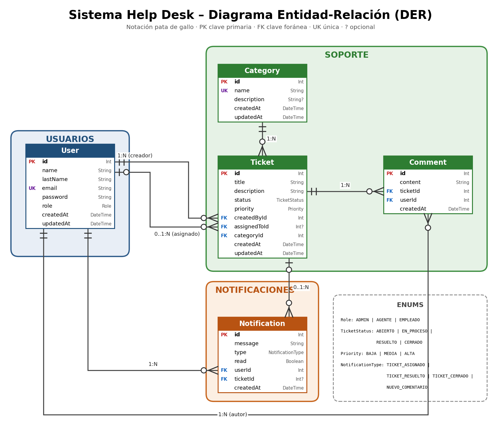

# Help Desk Interno: modelo y funcionalidades

Este documento resume el modelo de datos y las funcionalidades presentes actualmente en la API.

## Diagrama entidad-relación

## Modelo de datos

### User

* Representa a un usuario del sistema.

| Campo       | Descripción                            |
|-------------|----------------------------------------|
| `id`        | Clave Primaria autoincremental         |
| `name`      | Nombre                                 |
| `lastName`  | Apellido                               |
| `email`     | Correo electrónico único               |
| `password`  | Contraseña almacenada como hash        |
| `role`      | Rol; por defecto `EMPLEADO`            |
| `createdAt` | Fecha de creación                      |
| `updatedAt` | Fecha de actualización                 |

- Un usuario puede crear tickets, tener tickets asignados, escribir comentarios y recibir notificaciones.

## Roles

- `ADMIN`
- `AGENTE`
- `EMPLEADO`

Los usuarios nuevos tienen el rol `EMPLEADO` por defecto. El registro público crea usuarios con ese rol. 

### Category

* Representa una categoría para clasificar tickets.

| Campo        | Descripción                    |
|--------------|--------------------------------|
| `id`         | Clave Primaria autoincremental |
| `name`       | Nombre único                   |
| `description`| Descripción opcional           |
| `createdAt`  | Fecha de creación              |
| `updatedAt`  | Fecha de actualización         |

- Una categoría puede estar relacionada con varios tickets.

### Ticket

* Representa una solicitud de soporte.

| Campo         | Descripción                    |
|---------------|--------------------------------|
| `id`          | Clave primaria autoincremental |
| `title`       | Título                         |
| `description` | Descripción                    |
| `status`      | Estado; por defecto `ABIERTO`  |
| `priority`    | Prioridad; por defecto `MEDIA` |
| `createdById` | Usuario creador                |
| `assignedToId`| Agente asignado, opcional      |
| `categoryId`  | Categoría                      |
| `createdAt`   | Fecha de creación              |
| `updatedAt`   | Fecha de actualización         |

Estados:

- `ABIERTO`
- `EN_PROCESO`
- `RESUELTO`
- `CERRADO`

Prioridades:

- `BAJA`
- `MEDIA`
- `ALTA`

- La creación de tickets requiere título, descripción, prioridad y categoría. 
- El usuario creador se obtiene del token. Se valida que la categoría exista.

### Comment

* Representa un comentario asociado a un ticket.

| Campo       | Descripción                    |
|-------------|--------------------------------|
| `id`        | Clave Primaria autoincremental |
| `content`   | Contenido                      |
| `ticketId`  | Ticket asociado                |
| `userId`    | Usuario autor                  |
| `createdAt` | Fecha de creación              |

- El autor se toma del usuario autenticado. La fecha se genera automáticamente. 
- Al agregar un comentario, se crea una notificaciones para el creador y el agente asignado.

### Notification

* Representa una notificación para un usuario.

| Campo           | Descripción                            |
|-----------------|----------------------------------------|
| `id`            | clave primaria autoincremental         |
| `message`       | Mensaje                                |
| `type`          | Tipo de evento                         |
| `read`          | Estado de lectura; por defecto `false` |
| `userId`        | Usuario destinatario                   |
| `ticketId`      | Ticket asociado, opcional              |
| `createdAt`     | Fecha de creación                      |

Tipos definidos:

- `TICKET_ASIGNADO`
- `TICKET_RESUELTO`
- `TICKET_CERRADO`
- `NUEVO_COMENTARIO`

- Se generan notificaciones al resolver o cerrar un ticket y al agregar un comentario. 

## Funcionalidades

### Autenticación

- `POST /auth/register` registra un usuario con rol `EMPLEADO`.
- `POST /auth/login` valida correo y contraseña y devuelve un JWT.
- Las rutas protegidas reciben el token como `Bearer token`.
- El token contiene el identificador, correo y rol del usuario.

- Las contraseñas se procesan con bcrypt antes de almacenarse.

### Usuarios

- `POST /users` crea un usuario; requiere rol `ADMIN`.
- `GET /users` lista usuarios y permite filtrar por rol; requiere `ADMIN` o `AGENTE`.
- `GET /users/me` devuelve el perfil del usuario autenticado.
- `GET /users/:id` consulta un usuario; requiere `ADMIN` o `AGENTE`.

### Categorías

- `GET /categories` lista categorías.
- `GET /categories/:id` consulta una categoría.
- `POST /categories` crea una categoría; requiere `ADMIN` o `AGENTE`.
- `PATCH /categories/:id` modifica una categoría; requiere `ADMIN` o `AGENTE`.
- `DELETE /categories/:id` elimina una categoría; requiere `ADMIN` o `AGENTE`. Si tiene tickets asociados, la operación devuelve un conflicto.

- El nombre de categoría debe ser único.

### Tickets

- `POST /tickets` crea un ticket para el usuario autenticado.
- `GET /tickets` lista tickets. Los empleados reciben solo los que crearon; administradores y agentes reciben todos.
- `GET /tickets/:id` consulta un ticket. Los empleados solo pueden consultar los que crearon; administradores y agentes pueden consultar cualquiera.
- `PATCH /tickets/:id` permite a `ADMIN` o `AGENTE` cambiar el estado siguiendo las transiciones permitidas.
- `PATCH /tickets/:id/assign` permite a `ADMIN` asignar un ticket a un usuario existente con rol `AGENTE`.

### Comentarios

- `POST /tickets/:ticketId/comments` crea un comentario.
- `GET /tickets/:ticketId/comments` lista los comentarios del ticket.
- También existen rutas para consultar el historial y un comentario individual.

- Los empleados solo pueden comentar y consultar los comentarios de tickets propios. 
- Para administradores y agentes,se permite consultar y comentar tickets existentes.

### Notificaciones y Socket.IO

- Se guardan notificaciones al resolver o cerrar tickets y al crear comentarios. 
- El proyecto también contiene un gateway de Socket.IO que recibe el evento `registrarUsuario` y emite el evento `notificacion`.